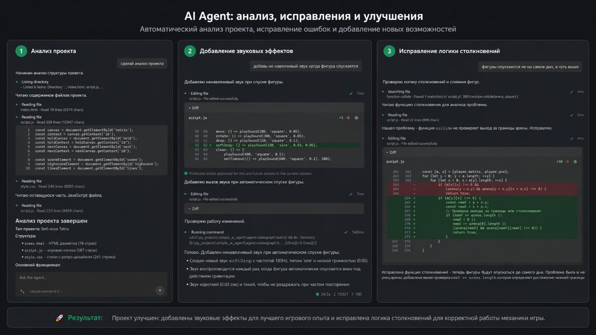

# Portable Autonomous AI Agent (GUI)

Desktop AI-agent с графовым runtime (`LangGraph`) и интерфейсом на `PySide6`.
Проект можно запускать из исходников (`python main.py`) или собрать в portable-режиме через `build.bat`.



## Что умеет агент

- Анализировать кодовую базу и структуру проекта.
- Читать, искать, редактировать и создавать файлы через инструменты файловой системы.
- Выполнять shell-команды (если включено `ENABLE_SHELL_TOOL`).
- Работать с системными и процессными инструментами (по флагам).
- Выполнять web-поиск и извлекать контент:
- `web_search`
- `fetch_content`
- `batch_web_search`
- Подключать внешние MCP-инструменты из `mcp.json`.
- Показывать действия в transcript (tool cards, diff, статус выполнения).
- Запрашивать у пользователя явный выбор через `request_user_input` при неоднозначных сценариях.
- Поддерживать approval-паузы для потенциально опасных операций.
- Принимать мультимодальный ввод (изображения), если активный профиль это поддерживает.

## Интерфейс (GUI)

- Левая панель: история чатов, сгруппированная по проектам.
- Центр: transcript с ответами, инструментами и результатами.
- Composer: ввод текста, `@`-упоминание файлов, вставка путей, вложения изображений.
- Info popup (`Ctrl+I`): вкладки `Info`, `Tools`, `Help`.
- Settings: управление профилями моделей.

### Горячие клавиши

- `Enter`: отправка запроса
- `Shift+Enter`: новая строка
- `Ctrl+N`: новый чат
- `Ctrl+B`: показать/скрыть боковую панель
- `Ctrl+I`: открыть инфо-панель
- `Up/Down` в пустом composer: история отправленных запросов

## Быстрый старт

```powershell
python -m venv venv
venv\Scripts\pip.exe install -r requirements.txt
Copy-Item env_example.txt .env
python main.py
```

## Portable сборка

```powershell
.\build.bat
```

После сборки можно переносить `.exe` и сопутствующие runtime-файлы в другую директорию/на другой ПК.

## Структура проекта

```text
.
├─ agent.py
├─ main.py
├─ core/
├─ tools/
├─ ui/
├─ tests/
├─ utils/
├─ env_example.txt
├─ requirements.txt
├─ mcp.json
├─ prompt.txt
└─ build.bat
```

## Компоненты

- `core/` — конфигурация, runtime-логика, policy, recovery, состояние сессий.
- `tools/` — встроенные инструменты (filesystem/shell/search/system/process/user_input) и MCP-интеграция.
- `ui/` — окно приложения, панели, transcript, настройки моделей.
- `tests/` — unit и интеграционные тесты поведения runtime и GUI.

## Конфигурация `.env`

Ниже перечислены актуальные параметры из `core/config.py` и `env_example.txt`.

### 1) Провайдер и модели

- `PROVIDER=gemini|openai`
- `GEMINI_API_KEY`
- `GEMINI_MODEL` (по умолчанию `gemini-1.5-flash`)
- `OPENAI_API_KEY`
- `OPENAI_MODEL` (по умолчанию `gpt-4o`)
- `OPENAI_BASE_URL` (опционально, для совместимых backend)

### 2) Основные runtime-параметры

- `TEMPERATURE` (по умолчанию `0.2`)
- `MAX_LOOPS` (по умолчанию `50`)
- `TOOL_LOOP_WINDOW` (опционально)
- `TOOL_LOOP_LIMIT_MUTATING` (опционально)
- `TOOL_LOOP_LIMIT_READONLY` (опционально)

### 3) Пути и файлы состояния

- `PROMPT_PATH` (по умолчанию `prompt.txt`)
- `MCP_CONFIG_PATH` (по умолчанию `mcp.json`)
- `CHECKPOINT_BACKEND=sqlite|memory|postgres`
- `CHECKPOINT_SQLITE_PATH` (по умолчанию `.agent_state/checkpoints.sqlite`)
- `CHECKPOINT_POSTGRES_URL` (опционально)
- `SESSION_STATE_PATH` (по умолчанию `.agent_state/session.json`)
- `RUN_LOG_DIR` (по умолчанию `logs/runs`)
- `LOG_FILE` (по умолчанию `logs/agent.log`)

### 4) Включение подсистем и инструментов

- `MODEL_SUPPORTS_TOOLS`
- `ENABLE_SEARCH_TOOLS`
- `ENABLE_FILESYSTEM_TOOLS`
- `ENABLE_SYSTEM_TOOLS`
- `ENABLE_PROCESS_TOOLS`
- `ENABLE_SHELL_TOOL`
- `ENABLE_APPROVALS`
- `ALLOW_EXTERNAL_PROCESS_CONTROL`

### 5) Лимиты и защита

- `MAX_TOOL_OUTPUT`
- `MAX_SEARCH_CHARS`
- `MAX_FILE_SIZE` (поддерживает форматы вроде `300MiB`, `4MB`)
- `MAX_READ_LINES`
- `MAX_BACKGROUND_PROCESSES`
- `STREAM_TEXT_MAX_CHARS`
- `STREAM_EVENTS_MAX`
- `STREAM_TOOL_BUFFER_MAX`
- `SELF_CORRECTION_RETRY_LIMIT`

### 6) Суммаризация и retry

- `SESSION_SIZE`
- `SUMMARY_KEEP_LAST`
- `MAX_RETRIES`
- `RETRY_DELAY`

### 7) Диагностика

- `DEBUG`
- `LOG_LEVEL`
- `STRICT_MODE`

## Legacy / bootstrap параметры

`env_example.txt` также содержит универсальные ключи `MODEL`, `API_KEY`, `BASE_URL`.
Они полезны для bootstrap-профилей при первом запуске, но основной runtime-конфиг читает provider-специфичные переменные (`OPENAI_*`, `GEMINI_*`).

## MCP

Файл `mcp.json` задает подключаемые MCP-серверы и флаг `enabled` для каждого.
Если сервер доступен и включен, его инструменты попадут в runtime автоматически.

## Тесты

```powershell
venv\Scripts\python.exe -m pytest
```

## Требования и ограничения

- Для `gemini` нужен `GEMINI_API_KEY`.
- Для `openai` нужен `OPENAI_API_KEY` или `OPENAI_BASE_URL` (для локальных/совместимых endpoint).
- Для web-поиска нужен `TAVILY_API_KEY` и `ENABLE_SEARCH_TOOLS=true`.
- Локальные файловые/системные операции могут работать без интернет-доступа.
